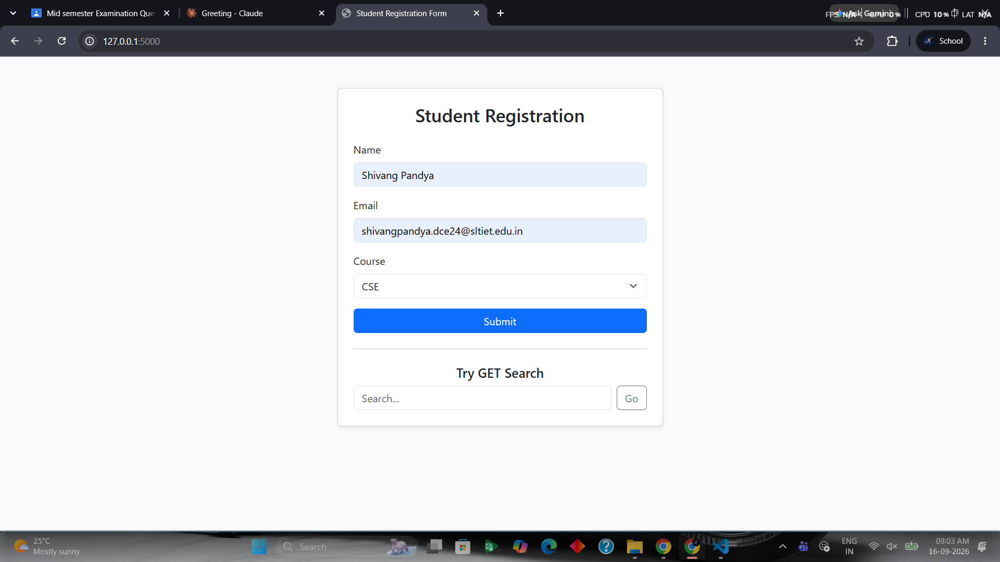

# Interactive Flask Web Forms Using GET/POST Methods and Bootstrap Styling

A simple Flask web application demonstrating **GET** and **POST** HTTP methods through interactive forms, styled with **Bootstrap** for a clean, responsive UI.

## 📌 Objective

To implement and understand Flask web forms using GET and POST methods, and to enhance the user interface using Bootstrap.

## 🛠️ Tech Stack

- **Backend:** Python, Flask
- **Frontend:** HTML, Bootstrap 5
- **Templating:** Jinja2

## 📂 Folder Structure

```
flask_form_app/
│
├── app.py
├── templates/
│   ├── form.html
│   └── result.html
└── README.md
```

## ⚙️ Requirements

- Python 3.x
- Flask

## 🚀 Setup & Installation

1. **Clone or download this project**

2. **Install Flask**
   ```bash
   pip install flask
   ```

3. **Run the application**
   ```bash
   python app.py
   ```

4. **Open in browser**
   ```
   http://127.0.0.1:5000/
   ```

## 🧩 Features

- **POST Form (Student Registration):** Collects Name, Email, and Course, and displays the submitted data on a result page. Data is sent in the request body, not visible in the URL.
- **GET Form (Search):** Accepts a search query passed via URL parameters (`/search?query=...`). Demonstrates URL-visible, bookmarkable data transfer.
- **Bootstrap Styling:** Responsive cards, form controls, and buttons — no custom CSS required.

## 🔀 Routes

| Route      | Method | Description                          |
|------------|--------|---------------------------------------|
| `/`        | GET    | Displays the registration + search form |
| `/submit`  | POST   | Processes registration form data      |
| `/search`  | GET    | Processes search query from URL       |

## 📊 GET vs POST

| Aspect          | GET                          | POST                         |
|-----------------|-------------------------------|-------------------------------|
| Data visibility | Appended to URL (visible)     | Sent in request body (hidden) |
| Use case        | Search, filters, bookmarkable links | Form submissions, sensitive/large data |
| Data limit      | Limited by URL length         | No practical limit            |

---

## Output



## 📝 Conclusion

This project demonstrates how Flask handles form submissions using both GET and POST methods, and how Bootstrap simplifies building a responsive, professional-looking UI without writing custom CSS.
